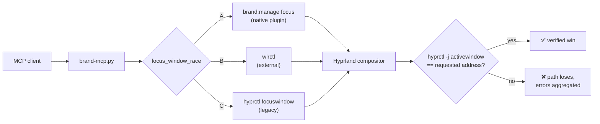

# 🐎 brand

### The Hyprland agent-control plane that refuses to lie about focus.

<div align="right">

[](https://github.com/toxicwind/brand)
[](https://hyprland.org)
[](LICENSE)
[](mcp/brand-mcp.py)
[](SECURITY.md)

</div>

> **Why should I care?** Every agent-control tool for Hyprland dispatches a focus
> command and trusts the `ok`. On Hyprland 0.56.x the IPC Lua API silently broke
> (`hl` is boolean `true` — `hyprctl eval "return type(hl.dsp)"` errors), so those
> `ok`s were fiction and agents typed into the wrong window. **brand races three
> independent actuation paths concurrently and only declares victory when the
> compositor itself reports the right window focused.** A bare `ok` that didn't
> move focus is a loss — retried, aggregated, and reported honestly.

Rebirth of the archived
[Hypr-Agent-Portal](https://github.com/gfhdhytghd/Hypr-Agent-Portal) — forked,
re-themed, and actively maintained by toxicwind.
The original author archived it believing CUA made it redundant; we disagree:
nobody else verifies focus.

---

- 🎯 **Hyper-race focus** — plugin dispatcher, `wlrctl`, and legacy `hyprctl`
  raced concurrently; first *strictly-verified* win takes it
- 🧬 **Native hyprpm plugin** — dispatchers run inside the compositor, immune to
  the IPC-Lua breakage: `manage`, `pointer`, `keyboard`, `screenshot`,
  `session`, `panic`, `guard`, `approval`
- 🛡️ **Stale-target refusal** — windows are identified by
  `address@pid@starttime`; a recycled address can never steal focus
- 🔍 **Honest errors** — `VerificationFailed` / `StaleTarget` taxonomy instead
  of silent success
- ⌨️ **AT-SPI input path** — accessibility-native typing, no ydotool daemon
- 🔒 **Security policy** — capability allowlists, panic mode, privacy denylist
  for screenshots, human input preempts the agent instantly
- 🧪 **Composable testing** — `BRAND_MOCK_COMPOSITOR=1` and `BRAND_DRY_RUN=1`
  let you develop the whole stack with no compositor at all

## Diagram



## Quick start

```sh
hyprpm add https://github.com/toxicwind/brand && hyprpm enable brand && hyprpm reload
```

```sh
python3 mcp/brand-mcp.py   # stdio MCP server — point your agent at it
```

```ini
# hyprland.conf — capabilities are opt-in
plugin {
  brand {
    allow_pointer = 1
    allow_keyboard = 1
    allow_screenshot = 1
    allow_session = 1
  }
}
```

## Architecture

| Layer | Lives in | Job |
|---|---|---|
| MCP server | `mcp/brand-mcp.py` | Tool surface: `window_action`, `type_into`, screenshots, OCR |
| Hyper-race | `mcp/brand_focus_race.py` | Races actuation paths, strict verification only |
| Window mgmt | `mcp/hypr_management.py` | Stale-target refusal, `VerificationFailed` taxonomy |
| Native plugin | `src/plugin/` (`libbrand.so`) | In-compositor dispatchers; bypasses broken IPC Lua |
| Input | AT-SPI | Focused-editable text insertion, no daemon |

The key insight: the plugin never touches the IPC Lua state, so the 0.56.x
`hl`-boolean breakage doesn't apply to it. The Python side treats the plugin as
the preferred path but never the *only* path — if the plugin is absent or
disabled, the race still runs on `wlrctl` + legacy `hyprctl`, verified the same
way.

## Config

Plugin block (`hyprland.conf`, hyprlang or Lua under `plugin.brand`):

| Key | Default | Purpose |
|---|---|---|
| `allow_pointer` | 1 | Background pointer dispatchers |
| `allow_keyboard` | 1 | Background keyboard dispatchers |
| `allow_screenshot` | 1 | Compositor screenshot dispatchers |
| `allow_session` | 1 | Workspace session dispatchers |
| `show_indicator` / `indicator_timeout_ms` | 1 / 30000 | On-screen agent-activity indicator |
| `cancel_on_human_input` | 1 | Physical input preempts the agent |
| `privacy_class_denylist` | KeePassXC,1Password | Classes hidden from screenshots |

Environment (local dev / CI — see `.env.example`):

| Variable | Purpose |
|---|---|
| `BRAND_DISABLE_PLUGIN=1` | Skip the native plugin path; race `wlrctl` + legacy only |
| `BRAND_DRY_RUN=1` | Log every actuation, change nothing |
| `BRAND_MOCK_COMPOSITOR=1` | Talk to the in-repo mock instead of a real compositor |

## Dev

```sh
# plugin
cmake -S . -B build && cmake --build build        # -> build/libbrand.so

# tests — self-contained runners, no pytest needed (mock compositor, no Hyprland)
python3 tests/mcp_smoke.py mcp/brand-mcp.py
for t in tests/*.py; do
  case "$t" in tests/mcp_smoke.py|tests/mock_compositor.py) continue;; esac
  python3 "$t"
done
```

## License + security

GPL-3.0 — see [LICENSE](LICENSE). Fork lineage: full upstream history preserved
(`upstream` remote → `gfhdhytghd/Hypr-Agent-Portal`).

Security model: [SECURITY.md](SECURITY.md). Short version — the plugin is a
deliberately narrow gateway: callers can't name arbitrary Hyprland dispatchers,
every window target is `address@pid@starttime` qualified, the session lock
blocks all management, and one `brand:panic` freezes everything.
